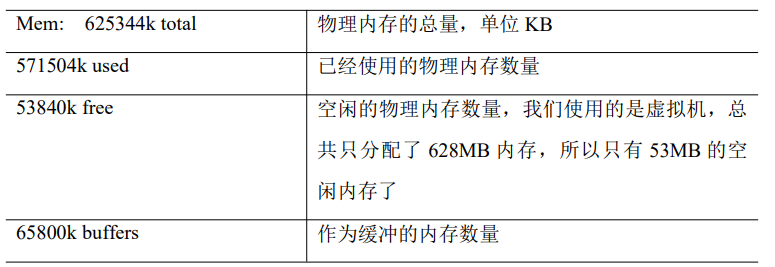

# Linux

## 1. 概述

**CentOS 下载地址**

```http
```

## 2. 目录结构


**bin**

*   是binary的缩写，存放最经常使用的命令

**sbin**

*   s是super user的意思，bin仍是binary的缩写，存储系统管理员才能使用的命令

**home**

*   存放普通用户的主目录，在linux中每个用户都有自己的目录，一般目录名与账户名相同

**root**

*   root用户根目录

**lib**

*   libanary的缩写，系统开机所需要的最基本的动态连接共享库，其作用类似于windows中的lld文件。

**lost+found**

*   一般情况该目录为空，存放当系统非法关机后的一些文件

**etc**

*   存放所有的系统管理所需要的配置文件和目录

**usr**

*   Unix System Resource 的简写，一般存放用户的应用程序，类似windows中program files 目录

**boot**

*   存的是启动linux时所使用的一些核心文件，包括一些连接文件以及镜像文件

**prod**

*   该目录时一个虚拟目录，它时系统内存的映射，可以通过直接访问这个目录来或系统信息

**srv**

*   service 缩写，该目录存放一些服务启动后所需要提取的数据

**sys**

*   ...

**tmp**

*   临时目录，linux会定期清理

**dev**

*   device 的缩写，文件映射设备的目录，类上windows的设备管理器，把所有的硬件用文件的形式存储

**media**

*   一些移动设备映射的目录，如U盘，光驱等。centos7 迁移到 /run/media

**mnt**

*   系统通过该目录时为了让用户临时管制别的文件系统的，可以将外部的存储挂在到mnt目录上，然后从该目录查看挂载设备的内容

**opt**

*   这个是给主机安装额外软件的的目录，当然存放在usr也可以。

**var**

*   一般存放则不断扩充的东西，如日志。

## 3. vim 编辑器

VIM 编辑器是从 VI 发展出来的一个性能更强大的文本编辑器。可以主动的以字体颜
色辨别语法的正确性，方便程序设计。


### 3.1 一般模式

以 vi 打开一个档案就直接进入一般模式了（默认的模式）。在这个模式中， 你可以使用『上下左右』按键来移动光标，你可以使用『删除字符』或『删除整行』来处理档案内容， 也可以使用『复制、粘贴』来处理你的文件数据。

| 语法            | 描述                    |
| --------------- | ----------------------- |
| yy              | 复制光标所在行          |
| y[n]y           | 复制n行，如 y5y 复制5行 |
| p               | 从光标所在行，粘贴      |
| u               | 撤销上一步              |
| dd              | 删除光标所在行          |
| d[n]d           | 删除从光标开始的n行     |
| x               | 截切一个字母            |
| X               | 截切一个字母            |
| yw              | 复制一个单词            |
| dw              | 删除一个单词            |
| shift + ^       | 移动到行头              |
| shift + \$      | 移动到行末              |
| [n] + shift + g | 移动到n行               |
| shift + g       | 移动到页尾              |
| w               | 想好移动一个单词        |

**补充**

GG：跳到行末句首

gg：跳到行首句首

0：跳转到当前行首

$：跳转到当前行末


### 3.2 编辑模式

该模式是堆文件进行编辑的模式。注意了！通常在Linux中，按下编辑按键时，在画面的左下方会出现『INSERT或 REPLACE』的字样，此时才可以进行编辑。而如果要回到一般模式时， 则必须要按下 『Esc』这个按键即可退出编辑模式。

**进入编辑模式**

| 按键 | 描述                       |
| ---- | -------------------------- |
| i    | insert缩写，当前光标前插入 |
| a    | append缩写，当前光标后插入 |
| o    | 当前光标下一行插入         |
| I    | 当前光标行前插入           |
| A    | 当前光标行后插入           |
| O    | 当前光标上一行插入         |

**退出编辑模式**

按『Esc』键 退出编辑模式，之后所在的模式为一般模式。

### 3.3 指令模式

在一般模式当中，输入『 : / ?』3个中的任何一个按钮，就可以将光标移动到最底下那 一行。 

在这个模式当中， 可以提供你『搜寻资料』的动作，而读取、存盘、大量取代字符、 离开 vi 、显示行号等动作是在此模式中达成的！

| 命令                | 功能                             |
| :------------------ | -------------------------------- |
| :w                  | 保存                             |
| :q                  | 退出                             |
| :!                  | 强制执行                         |
| :noh                | no height 缩写，取消高亮         |
| :set nu             | 显示行号                         |
| :set nonu           | 关闭行号                         |
| :%s/oldstr/newstr/g | 替换内容，/g替换匹配到的所有内容 |

**替换**

* 先输入冒号（：），进入命令行模式。:s  表示替换

* 确定影响行数。$表示最后一行。如 :1,$s/abc/xyz/g 注意最后的/g 表示所有匹配到的都要替换。

* 最终版(推荐) :%s 替换所有。反斜杠 \ 转义字符

    ```vim
    格式
    :%s/要替换的旧字符/新字符/g
    匹配和替换“http://roclinux.cn/index.php”这样一个 URL
    :%s/http:\/\/roclinux\.cn\/index\.php/https:\/\/www\.baidu\.com/index\.php/g
    ```

**选择与复制**

- **按字符选择** 在“正常”行模式下，按“`v`”（小写），进入按字符选择模式，移动光标选择要进行复制的字符

    选择完成后按“`y`”进行复制，按“`p`”进行粘贴

- **按行选择** 在“命令”行模式下，按“`V`”（大写），进入行选择模式，移动光标选择要进行复制的行。选择完成后按“`y`”进行复制，按“`p`”进行粘贴

- **按块选择** 在“命令”行模式下，按组合键`Ctrl+v`进入到按块选择模式，移动光标选择要进行复制的块。按“`y`”进行复制，按“`p`”进行粘贴

## 4. 系统配置

### 4.1 VMware 网络和网关设置

#### 4.1.1 网络连接模式


**桥接模式**

在桥接模式下，PC与VM是平等关系，可以认为vm就是另外一台PC，PC与VM之间通过一个虚拟桥接器连接起来，但是桥接器只能连接一个设备，所以还有虚拟交换机，虚拟桥接器连接虚拟交换机，虚拟交换机连接VM，所以PC与VM是平等的，他们共同的网关都是路由器，VM与PC在同一个网段内，所以是可以通信的。VMnet1 虚拟网卡就是PC与VM通信的“设备”。

缺点：同一个网段内可见，不是那么的私密了，消耗地址池的地址。

****

**NAT模式**

在NAT模式下，PC和VM是两个不同的网络（可能不在同一网段）。NAT模式下通过“虚拟机路由器“，“虚拟交换机”（类似）连接VM。在该模式下要实现PC和VM的通信，必须设置好虚拟网卡网关，IP必须和网关在同一个网段了才能和pc通信。


****

**仅主机模式**

不能连接外网，一般不使用。

### 4.2 网络配置

**查看当前网络**

```sh
ifconfig
# 或者
ip addr
```

**测试网络连接**

```sh
ping 目的主机ip或者域名地址
```

#### 4.2.1 配置静态IP

在NAT模式，是配置有DHCP服务器（动态IP分配），在系统重启之后vm的IP可能出现改变。

**查看IP配置文件**

```sh
vim /etc/sysconfig/network-scripts/ifcfg-ens33
```

```txt
TYPE="Ethernet"
PROXY_METHOD="none"
BROWSER_ONLY="no"
# 静态IP时为static
BOOTPROTO="static"
DEFROUTE="yes"
IPV4_FAILURE_FATAL="no"
IPV6INIT="yes"
IPV6_AUTOCONF="yes"
IPV6_DEFROUTE="yes"
IPV6_FAILURE_FATAL="no"
IPV6_ADDR_GEN_MODE="stable-privacy"
NAME="ens33"
UUID="44f8456b-862e-4c71-9a8d-eb513d200f9a"
# 接口名（设备，网卡）
DEVICE="ens33"
ONBOOT="yes"
IPADDR=静态IP地址
PREFIX=24
GATEWAY=网关地址（VMnet8）
DNS1=DNS域名解析地址（同网关）  
```

**重启网络**

```sh
service network restar
```

### 4.3 主机配置

#### 4.3.1 主机名称

**查看主机名称**

```sh
hostname
```

**修改主机名称**: 重启后生效

```sh
vim /etc/hostname
```

#### 4.3.2 hosts 映射文件

类似于windows中hosts文件，名称映射主机。

```sh
vim /etc/hosts
```

```txt
192.168.2.100 hadoop100
192.168.2.101 hadoop101
192.168.2.102 hadoop102
192.168.2.103 hadoop103
```

## 5. 系统管理

计算机中，一个正在执行的程序或命令，被叫做“进程”（process）。 启动之后一只存在、常驻内存的进程，一般被称作“服务”（service）

### 5.1 service 服务管理

service 服务管理是centos6 版本提供的，centos7同样支持。

在 centos6以及之前，服务放在目录/etc/init.d/下面。

**基本语法**

```sh
service 服务名 start|stop|restart|status
```

**默认服务**: 默认netconsole, network两个服务。

```sh
ll /etc/init.d
```


**案例**

*   查看网络服务状态

    ```sh
    service network status
    ```

*   停止网络服务

    ```sh
    service network stop
    ```

*   启动网络服务

    ```sh
    service network start
    ```

*   重启网络服务

    ```sh
    service network restart
    ```

#### 5.1.1 服务开机启动

 chkconfig 设置后台服务的自启配置（CentOS 6 版本）

**基本语法**

```sh
# 功能描述：查看所有服务器自启配置
chkconfig
# 功能描述：关掉指定服务的自动启动
chkconfig 服务名 off
# 功能描述：开启指定服务的自动启动
chkconfig 服务名 on
# 功能描述：查看服务开机启动状态
chkconfig 服务名 --list
```

*   chkconfig

    0-6 代表服务级别

    

*   chkconfig 服务名 --list

    

### 5.2 systemctl 服务管理

 systemctl 服务管理是centos7 版本提供的。其服务放在/usr/lib/systemd/system目录下


**基本语法**

```sh
systemctl start | stop | restart | status 服务名
```


*   查看防火墙服务的状态 

```sh
systemctl status firewalld 
```

*   停止防火墙服务 

 ```sh
 systemctl stop firewalld
 ```

*   启动防火墙服务 

```sh
systemctl start firewalld 
```

*   重启防火墙服务

```sh
 systemctl restart
```

#### 5.2.1 systemctl 设置服务开启启动

```sh
# 功能描述：查看服务开机启动状态
systemctl list-unit-files
# 功能描述：关掉指定服务的自动启动
systemctl disable 服务名
# 功能描述：开启指定服务的自动启动
systemctl enable 服务名
```

**案例**：开启/关闭 iptables(防火墙)服务的自动启

```sh
systemctl enable firewalld.service
systemctl disable firewalld.service
```

### 5.3 系统运行级别

| init级别 | systemctl target  |                                                             |
| -------- | ----------------- | ----------------------------------------------------------- |
| 0        | shutdown.target   | 系统停机状态，系统默认运行级别不能设为0，否则不能正常启动   |
| 1        | emergency.target  | 单用户工作状态，root权限，用于系统维护，禁止远程登陆        |
| 2        | rescure.target    | 多用户状态(没有NFS)                                         |
| 3        | multi-user.target | 完全的多用户状态(有NFS)，登陆后进入控制台命令行模式         |
| 4        | 无                | 系统未使用，保留                                            |
| 5        | graphical.target  | X11控制台，登陆后进入图形GUI模式                            |
| 6        | 无                | 系统正常关闭并重启，默认运行级别不能设为6，否则不能正常启动 |

### 5.4 关机重启命令

| 命令                 | 描述                                                         |
| -------------------- | ------------------------------------------------------------ |
| sysn                 | 将数据由内存同步到硬盘中                                     |
| halt                 | 停机，关闭系统，但不断电                                     |
| poweroff             | 关机，断电                                                   |
| reboot               | 就是重启，等同于 shutdown -r now                             |
| shutdown [选项] 时间 | [选项]： -H相当于--halt，停机。 -r 就是重启。时间：now立即关机，其他整数，等待多久后关机（单位是分钟）。 |

## 6. 帮助命令

### 6.1 man 获取帮助信息

**基本语法**

```sh
# 获得帮助信息
man [命令或者配置文件]
```

**显示说明**

| 信息        | 功能                   |
| ----------- | ---------------------- |
| name        | 命令的名称和单行描述   |
| synopsis    | 怎么样使用命令         |
| description | 命令描述               |
| examples    | 命令使用案例           |
| see also    | 相关主题（通常是手册） |


### 6.2 help 获取shell 内置命令帮助信息

>   一部分基础功能的系统命令是直接内嵌在 shell 中的，系统加载启动之后会随着 shell 一起加载，常驻系统内存中。这部分命令被称为“内置（built-in）命令”；相应的其它命令 被称为“外部命令”

**基本语法**

```sh
# 获得帮助信息
help [内置命令]
```

## 7. 文件目录类命令

### 7.1 目录类

#### pwd 打印工作目录

pwd： print working directory 打印工作目录

**案例**

```sh
pwd
```

#### ls 列举内容

**基本语法**

```sh
ls [选项] [目录或是文件
```

| 选项 | 功能                                                         |
| ---- | ------------------------------------------------------------ |
| -a   | all 全部的文件，连同隐藏档( 开头为 . 的文件) 一起列出来(常用) |
| -l   | long  长数据串列出，包含文件的属性与权限等等数据；(常用)等价于“ll” |

**显示说明**

每行列出的信息依次是： 

1.   文件类型与权限 
2.   链接数 
3.   文件属主 
4.   文件属组 
5.   文件大小用byte 来表示 
6.   建立或最近修改的时间 
7.   名称


PS：. 和 .. 也是目录

#### tree 层级展示目录

>   tree命令，默认是没有的需要安装。

```sh
# 安装tree
yum install tree
```

**脚本语法**

```sh
tree [选项] 目录
```

**选项说明**

| 选项    | 功能                        |
| ------- | --------------------------- |
| -L 整数 | 展示目录的深度，推荐要加 -L |
| ......  |                             |

#### cd 切换目录

cd:Change Directory 切换目录

**基本语法**

```sh
cd [参数]
```

| 参数       | 功能                                 |
| ---------- | ------------------------------------ |
| 绝对路径   | 切换路径                             |
| 相对路径   | 切换路径                             |
| cd ~或者cd | 回到自己的家目录                     |
| cd -       | 回到上一次所在目录                   |
| cd..       | 回到当前目录的上一级目录             |
| cd -P      | 跳转到实际物理路径，而非快捷方式路径 |

#### mkdir 创建目录

mkdir:Make 创建目录

**基本语法**

```sh
mkdir [选项] 要创建的目录名(多个是用空格隔开)
```

| 参数 | 功能                |
| ---- | ------------------- |
| -p   | parent 创建多层目录 |

**案例**

```sh
# 要求目标目录的上一层目录必须存在才能创建成功
mkdir a b aa/bb/cc
# 创建多层目录
mkdir -p 111/222/333
```

#### rmdir 删除空目录

rmdir:Remove directory 移除空目录

**基本语法**

```sh
rmdir 要删除的空目录(多个目录勇空格隔开)
# 删除多个层级的空目录
rmdir -p a/b/c
```

**案例**

```sh
rmdir a b
```

### 7.2 文件类

#### touch 创建文件

**基本语法**

```sh
touch /目录/文件名称（创建多个文件用空格隔开）
```

**案例**: 如果文件已经存在，并不会覆盖。

```sh
touch a.txt b.txt
```

#### cp 复制文件或目录

cp: copy

**基本语法**

```sh
# 复制source到dest
cp [选项] source dest
```

| 选项 | 功能                       |
| ---- | -------------------------- |
| -r   | recursion 递归复制整个目录 |

**参数说明**

| 参数   | 功能                                                         |
| ------ | ------------------------------------------------------------ |
| source | 源文件或目录，若是目录一般加-r                               |
| dest   | 目的地。1：若source是文件，dest是目录则是复制到该目录，若是文件（dest不存在或已经存在文件）。2. 若source是文件，dest是目录 |

强制覆盖不提示的方法：\cp。type cp发现cp是cp -i的别名。

**案例**

```sh
cp -r /a/b/ ./
```

#### rm 删除文件或目录

rm: remove

**基本语法**

```sh
# 递归删除目录中所有内容
rm [选项] deleteFile
```

**选项说明**

| 选项 | 功能                                           |
| ---- | ---------------------------------------------- |
| -r   | recursion 递归删除目录中所有内容               |
| -f   | force 强制执行删除操作，而不提示用于进行确认。 |
| -v   | view 显示指令的详细执行过程                    |

**案例**

```sh
# 准备
mkdir -r /a/b/c
touch a/b/c/a.txt

# 删除
rm -rf a
```

**PS**: rm 不加参数只能删除文件，若要删除目录必须加参数-r或者-f。

#### mv 移动文件与目录或重命名

mv： move

**基本语法**

```sh
# 重命名, newNameFile是不存在的
mv oldNameFile newNameFile

# 移动文件，targetFolder是目录且必须存在
mv movefile targetFolder （功能描述：移动文件）
```

### 7.3 查看文件内容类

#### cat 查看文件内容

cat：catch 查看文件内容，从第一行开始显示，需要滚轮上下查看内容，一般查看比较小的文件，一屏幕能显示全的。

**语法格式**

```sh
cat [选项] 要查看的文件
```

**选项说明**

| 选项 | 描述                       |
| ---- | -------------------------- |
| -n   | 显示所有行的行号，包括空行 |

**案例**

```sh
cat -n ./a.txt
```

#### more 分屏查看文件内容

more 指令是一个基于 VI 编辑器的文本过滤器，它以全屏幕的方式按页显示文本文件的内容（一页一页的显示）。

**基本语法**

```sh
more 要查看的文件
```

**快捷键**

| 操作          | 功能说你                               |
| ------------- | -------------------------------------- |
| 空格键        | 代表向下翻一页                         |
| Enter         | 代表向下翻『一行』                     |
| q             | 代表立刻离开 more ，不再显示该文件内容 |
| Ctrl+F 或者 F | forward 向下滚动一屏                   |
| Ctrl+B        | back 返回上一屏                        |
| =             | 输出当前行的行号                       |
| :f            | 输出文件名和当前行的行号               |

#### less 分屏查看文件内容

less 指令用来分屏查看文件内容，它的功能与 more 指令类似，但是比 more 指令更加 强大，支持各种显示终端。less 指令在显示文件内容时，并不是一次将整个文件加载之后才显示，而是根据显示需要加载内容，对于显示大型文件具有较高的效率。

**语法格式**

```sh
less 要查看的文件
```

**快捷键**

| 操作               | 功能说你                                           |
| ------------------ | -------------------------------------------------- |
| 空格键             | 代表向下翻一页                                     |
| pagedown \| pageup |                                                    |
| /字符串            | 向下搜寻『字串』的功能；n：向下查找；N：向上查找； |
| Ctrl+F 或者 F      | forward 向下滚动一屏                               |
| Ctrl+B 或者 B      | back 返回上一屏                                    |
| =                  | 输出当前行的行号                                   |
| q                  | 离开 less 这个程序                                 |

#### echo

echo 的作用输出内容到控制台

**基本语法**

```sh
echo [选项] [输出内容]
```

| 选项 | 作用         |
| ---- | ------------ |
| -e   | 支持转义字符 |

**注意**：输出内容一般将双引号（不然多个空格只会输出一个），-e参数才能使用转义字符（否则双引号的内容原样输出）

#### head 显示文件头部内容

head 用于显示文件的开头部分内容，默认情况下 head 指令显示文件的前 10 行内容。

**基本语法**

```sh
# 查看文件头10行内容
head 文件
# 查看文件头5行内容，5可以是任意行数
head -n 5 文件
```

**选项说明**

| 选项    | 功能                   |
| ------- | ---------------------- |
| -n 行数 | 指定显示头部内容的行数 |

#### tail 输出文件尾部内容

tail 用于输出文件中尾部的内容，默认情况下 tail 指令显示文件的后 10 行内容。

**基本语法**

```sh
# 查看文件尾部10行内容
tial 文件
# 查看文件尾部5行内容，5可以是任意行数
tail -n 5 文件
# 实时追踪该文档的所有更新
tail -f 文件
```

**选项说明**

| 选项    | 功能                                 |
| ------- | ------------------------------------ |
| -n 行数 | 指定显示尾部内容的行数               |
| -f      | 显示文件最新追加的内容，监视文件变化 |

#### > 与 >> 重定向

**输出重定向**：>

*   使用>重定向到文件，若文件不存在则创建并追加内容，若文件已经存在则覆盖原内容

**追加**：>>

*   最后追加内容（文件不存在则会创建文件后追加）

**案例**

```sh
ll > ll.txt
```

### 7.4 链接类

#### ln -s 软链接

ln: link 软链接也称为符号链接，类似于 windows 里的快捷方式，有自己的数据块，主要存放 了链接其他文件的路径（类似指针）。可以链接文件或者目录。

**基本语法**

```sh
# 给原文件或目录创建一个软链接
ln -s [原文件或目录] [软链接名]
```

**选项说明**

| 选项 | 功能            |
| ---- | --------------- |
| -s   | soft 创建软链接 |

**注意事项**

删除软链接： rm -rf 软链接名（只会删除链接不删除原文件），而不是 rm -rf 软链接名/

<font color="red">如果使用 rm -rf 软链接名/ 删除，会把软链接对应的真实目录下内容删掉</font>

查询：通过 ll 就可以查看，列表属性第 1 位是 l，尾部会有位置指向。

**案例**：

*   创建软连接

```sh
ln -s /opt/a/ a
```


*   删除软连接：注意不要写最后的/不要加

```sh
rm -rf a
```

*   进入软连接实际物理路径

```sh
cd -P a
```

#### ln 硬链接

实质上是一个指针，指向文件索引节点，系统并不为它重新分配inode。使用 ln 来创建。

**特点**：

1.   不允许给目录创建硬链接

2.   只有在同一个文件系统才能创建(不能跨文件系统)

 为file1创建一个硬链接，file1的链接数目就会增加。当删除链接时，链接数减1，当链接数为0时，内核才会把文件内容从磁盘上删除。

## 8. 时间日期类命令

### 8.1 data 时间日期类

**基本语法**

```sh
date [OPTION]... [+FORMAT]
```

**选项说明**

| 选项          | 功能                                           |
| ------------- | ---------------------------------------------- |
| -d 时间字符串 | 显示指定的“时间字符串”表示的时间，而非当前时间 |
| -s 日期时间   | 设置系统日期时间                               |

**参数说明**

| 参数                | 功能                         |
| ------------------- | ---------------------------- |
| +日期时间格式字符串 | 指定显示时使用的日期时间格式 |

**基本使用**: 日期时间格式字符串最好双引号括起来，不然多个字符时不支持空格

```sh
（1）date 						（功能描述：显示当前时间）
（2）date +%Y 					（功能描述：显示当前年份）
（3）date +%m 					（功能描述：显示当前月份）
（4）date +%d 					（功能描述：显示当前是哪一天）
（5）date "+%Y-%m-%d %H:%M:%S" 	（功能描述：显示年月日时分秒)
```

### 8.2  cal 日历类

**基本语法**

```sh
# 不加选项，显示本月日历
cal [选项]
```

**选项说明**

| 选项       | 功能             |
| ---------- | ---------------- |
| 具体某一年 | 显示这一年的日历 |

**案例**

```sh
cal 2017
```

## 9. 用户管理类命令

### useradd 添加新用户

**基本语法**

```sh
# 添加用户，默认会在/home创建一个相同名字的目录作为家目录，同时创建一个同名的用户组并加入权重
useradd 用户名

# 添加新用户到某个组
useradd -g 用户组名 用户名
```

**案例**

```sh
useradd katou
```


### passwd 设置用户密码

**基本语法**

```sh
# 设置用户密码
passwd 用户名
```

**案例**

```sh
passwd katou
```


### id 查看用户是否存在

id 命名只能查看某个用户是否存在。

**基本语法**

```sh
# 查看用户是否存在
id 用户名
```

**案例**


### cat /etc/passwd 查看所有用户

cat /etc/passwd 查看创建了哪些用户，该文件列举的很多用户并不能登录而是执行某些操作的用户。


### su 切换用户

su：switch user 切换用户

**基本语法**

```sh
# 切换用户，只能获得用户的执行权限，不能获得环境变量
su 用户名称

# 切换到用户并获得该用户的环境变量以及执行权限
su - 用户名称
```

su 切换用户其实是一个会话嵌套。通过exit一层层退出会话。


### userdel 删除用户

**基本语法**

```sh
# 删除用户但保存用户主目录，如果后续需要删除目录直接删除即可
userdel 用户名

# 用户和用户主目录，都删除
userdel -r 用户名 
```

**选项说明**：视情况而定，如果该用户家目录的文件以及不会再用到了则-r（=userdel + rm）

| 选项 | 功能                                     |
| ---- | ---------------------------------------- |
| -r   | 删除用户的同时，删除与用户相关的所有文件 |

**案例**


### who 查看登录用户

**基本语法**

```sh
# 显示所有登录的用户
who
# 显示自身用户名称(用哪个用户就显示哪个用户，su之后就是su之后的用户)
whoami
# 显示原始登录用户的用户名以及登陆时间
who am i
```

**案例**


### sudo 设置普通用户具有 root 权限

1.   需要修改配置文件

```sh
vim /etc/sudoers
```

2.   添加内容

```txt
## Allow root to run any commands anywhere
用户名 ALL=(ALL) ALL
```

之后就可以使用sudo

**基本语法**

```sh
sudo 命令
```

### usermod 修改用户的用户组

**基本语法**

```sh
usermod -g 用户组 用户名
```

**选项说明**


| 选项 | 功能                                                 |
| ---- | ---------------------------------------------------- |
| -g   | 修改用户的初始登录组，给定的组必须存在。默认组 id 是 |

**案例**：将用户加入到用户组


## 10. 用户组管理类命令

每个用户都有一个用户组，系统可以对一个用户组中的所有用户进行集中管理。不同 Linux 系统对用户组的规定有所不同，如Linux下的用户属于与它同名的用户组，这个用户组在创建用户时同时创建。用户组的管理涉及用户组的添加、删除和修改。组的增加、删除和修改实际上就是对 /etc/group文件的更新。

### groupadd 新增用户组

**基本语法**

```sh
groupadd 用户组名
```

**案例**

```sh
groupadd guestgroup
```

### groupdel 删除用户组

**基本语法**

```sh
groupdel 用户组名
```

**案例**

```sh
groupdel guestgroup
```

### groupmod 修改组名

**基本语法**

```sh
groupmod 新组名 就组名
```

**案例**

```sh
groupmod -n guest guestgroup
```

**参数选项**

| 选项 | 功能                   |
| ---- | ---------------------- |
| -n   | new 指定工作组的新组名 |

### cat /etc/group 查看所有组

## 11. 文件权限类命令

Linux系统是一种典型的多用户系统，不同的用户处于不同的地位，拥有不同的权限。 为了保护系统的安全性，Linux系统对不同的用户访问同一文件（包括目录文件）的权限做了不同的规定。在Linux中我们可以使用ll或者ls -l命令来显示一个文件的属性以及文件所属的用户和组。


从左到右的 10 个字符表示，如图 。如果没有权限，就会出现减号[ - ]


**1-从左至右用0-9这些数字字符含义**：

*   0 首位表示文件类型：在Linux中第一个字符代表这个文件是目录、文件或链接文件等等
    *   “-”代表文件
    *   “d”代表目录
    *   “l”代码链接文档
    *   “c”代表字符设备，如鼠标字符
    *   “b”代表块设备，如U盘
*   第1-3位确定属主（该文件的所有者-用户）拥有该文件的权限。---User
*   第4-6位确定属组（所有者的同组用户-用户组）拥有该文件的权限，---Group
*   第7-9位确定其他用户拥有该文件的权限 ---Other

****

**2-rwx 作用文件和目录的不同解释**

>   （1）作用到文件:
>
>   *   [ r ]代表可读(read): 可以读取，查看
>   *   [ w ]代表可写(write): 可以修改，但是不代表可以删除该文件，删除一个文件的前提条件是对该文件所在的目录有写权限，才能删除该文件。
>   *   [ x ]代表可执行(execute):可以被系统执行（前提是可执行文件，不然可执行权限没没什么作用）
>
>   （2）作用到目录：
>
>   *    [ r ]代表可读(read): 可以读取，ls查看目录内容 
>   *    [ w ]代表可写(write): 可以修改，目录内创建+删除+重命名目录或文件
>   *    [ x ]代表可执行(execute):可以进入该目录


1.   如果查看到是文件：链接数指的是硬链接个数。
2.   如果查看的是文件夹：链接数指的是子文件夹个数。

### chmod 修改权限

**方式一**：u:所有者  g:所有组  o:其他人   a:所有人(u、g、o的总和）

```sh
chmod [{ugoa}{+-=}{rwx}] 文件或目录
# 案例
chmod g+w ./a.txt
```


**方式二**：

```sh
chmod [ugo的权限数字表示 ] [文件或目录]
# 案例
chmod 777 ./dirOrFile
```

*   r =4 ：100
*   w=2：010
*   x =1：001

**PS**：文件的权限和目录的权限是不同，用户具有目录的权限不代表具有该目录下文件的权限，相反的用户具有文件的权限不代表它具有目录的权限。

### acl 权限控制

...略

### chown 改变所有者

**基本语法**

```sh
# 改变文件或者目录的所有者
chown [选项] [最终用户] 
```

**选项说明**

| 选项 | 功能     |
| ---- | -------- |
| -R   | 递归操作 |

**案例**

```sh
# 修改文件所有者
chown guest houge.txt

# 递归改变文件所有者和所有组
chown -R guest:guestGroup guestDir/
```

### chgrp 改变所属组

**基本语法**

```sh
# 改变文件或者目录的所属组
chgrp [最终用户组] [文件或目录]
```

## 12. 搜索查找类命令

### find 查找文件或者目录

>   find 指令将从指定目录向下递归地遍历其各个子目录，将满足条件的文件显示在终端。

**基本语法**

```sh
find [搜索范围] [选项]
```

**选项说明**

| 选项  | 说明                                                         |
| ----- | ------------------------------------------------------------ |
| -name | 按照指定的文件名查找模式查找文件，支持通配符                 |
| -user | 查找属于指定用户名所有文件                                   |
| -size | 按照指定的文件大小查找文件,单位为 :<br /> b —— 块（512 字节）<br /> c —— 字节 <br /> w —— 字（2 字节）<br /> k —— 千字节 <br /> M —— 兆字节 <br /> G —— 吉字节<br />+代表大于；- 代表小于；=代表等于 |

**案例**

1.   根据名称查找/目录下的filename.txt文件。

     ```sh
     find /opt/ -name "*.txt"
     ```

2.   按拥有者：查找/opt目录下，用户名称为-user的文件

     ```sh
     find /opt/ -user guest
     ```

3.   按文件大小：在/opot目录下查找大于200m的文件

     ```sh
     find /opt -size +204800
     ```

### locate 快速定位文件路径

>   locate 指令利用事先建立的系统中所有文件名称及路径的 locate 数据库实现快速定位给 定的文件。Locate 指令无需遍历整个文件系统，查询速度较快。为了保证查询结果的准确 度，管理员必须定期更新 locate 时刻。
>
>   由于 locate 指令基于数据库进行查询，所以第一次运行前，必须使用 updatedb 指令创 建 locate 数据库。

**基本语法**

```sh
locate 搜索文件
```

**案例**

```sh
updatedb
locate testfile
```

### grep 过滤查找与管道符 “|”

>   管道符，“|”，表示将前一个命令的处理结果输出传递给后面的命令处理。

**基本语法**

```sh
grep 选项 查找内容 源文件
```

**选项说明**

| 选项 | 说明               |
| ---- | ------------------ |
| -n   | 显示匹配行及行号。 |

**案例**

```sh
ll ./ | grep -n a.txt
```

### which

>   which命令是用来查找命令的脚本文件在哪里的命令（用来查找命令的）。

**基本语法**

```sh
which 可执行命令
```


## 13. 压缩和解压类命令

### gzip/gunzip

>   gzip/gunzip是压缩和解压的一对命令。gzip只能压缩文件不能压缩目录，并且压缩之后不保留原来的文件，所有记得备份文件；可同时多个文件，但会产生多个压缩包。
>
>   ps：这两个命令基本不用

**基本语法**

```sh
# 压缩文件，只能将文件压缩为*.gz 文件
gzip 文件[...多个文件用空格隔开]

# 解压缩文件命令
gunzip 文件.gz
```

**案例**


### zip/unzip

>   zip/unzip 是一个比gzip/gunzip功能更加强大的压缩和解压工具。可压缩目录，可以递归压缩。zip 压缩命令在windows/linux都通用，可以压缩目录且保留源文件。

**基本语法**

```sh
# 压缩文件和目录的命令
zip [选项] XXX.zip 将要压缩的内容
# 解压缩文件
unzip [选项]
```

**选项说明**

| zip 选项 | 功能         |
| -------- | ------------ |
| -r       | 递归压缩目录 |

| unzip 选项 | 功能                     |
| ---------- | ------------------------ |
| -d <目录>  | 指定解压后文件的存放目录 |

**案例**


unzip


### tar 打包

>   tar命令本身不是压缩解压命令，但其可以配合压缩和解压命令打包同时压缩解压。

**基本语法**

```sh
# 打包目录，压缩后的文件格式.tar.gz）
tar [选项] XXX.tar.gz 将要打包进去的内容
```

**选项说明**

| 选项 | 功能                             |
| ---- | -------------------------------- |
| -z   | gzip 使用gzip                    |
| -x   | extract  解包.tar 文件           |
| -v   | verbose 显示详细信息（进度）     |
| -f   | file 指定压缩后的文件名          |
| -c   | create 产生.tar 打包文件（打包） |
| -C   | 解压到指定目录                   |
|      |                                  |

**案例**


解压

```sh
tar -zxvf dir.tar.gz -C ./
```

## 14. 磁盘类命令

### du  查看文件和目录占用的磁盘空间

du：disk usage 磁盘占用情况

**基本语法**

```sh
# 显示目录下每个子目录的磁盘使用情况
du [选项] 目录/文件
```

**选项说明**

| 选项          | 功能                                                         |
| ------------- | ------------------------------------------------------------ |
| -h            | human 以人们较易阅读的 GBytes, MBytes, KBytes 等格式自行显示 |
| -a            | 不仅查看子目录大小，还要包括文件                             |
| ~~-c~~        | ~~显示所有的文件和子目录大小后，显示总和~~                   |
| -s            | 只显示总和                                                   |
| --max-depth=n | 指定统计子目录的深度为第 n 层                                |
|               |                                                              |

### df 查看磁盘空间使用情况

df：disk free 空余磁盘

**基本语法**

```sh
# 列出文件系统的整体磁盘使用量，检查文件系统的磁盘空间占用情况
df [选项]
```

**选项说明**

| 选项 | 功能                                                         |
| ---- | ------------------------------------------------------------ |
| -h   | human 以人们较易阅读的 GBytes, MBytes, KBytes 等格式自行显示； |

**案例**：显示各种分区大小


### free 查看内存使用情况

**基本语法**

```sh
free [选项]
```

| 选项 | 功能                                                         |
| ---- | ------------------------------------------------------------ |
| -h   | human 以人们较易阅读的 GBytes, MBytes, KBytes 等格式自行显示 |
| -m   | 单位                                                         |
| -g   | 单位                                                         |

**案例**


*   mem：内存
*   swap：交换

## 15. 进程管理类

### ps 查看当前系统进程状态

ps：process status 进程状态

**基本语法**

```sh
# 方式1：查看系统中所有进程
ps aux | grep xxx
# 方式2：可以查看子父进程之间的关系
ps -ef | grep xxx
```

**选项说明**

| 选项    | 功能                                       |
| ------- | ------------------------------------------ |
| a       | 列出带有终端的所有用户的进程               |
| x       | 列出当前用户的所有进程，包括没有终端的进程 |
| u       | 面向用户友好的显示风格                     |
| -e      | 列出所有进程                               |
| -f      | 显示完整格式的进程列表                     |
| -u 用户 | 列出某个用户关联的所有进程                 |

**功能说明**

==1）ps aux 显示信息说明==


*   USER：该进程是由哪个用户产生的

*   PID：进程的 ID 

*   %CPU：该进程占用 CPU 资源的百分比，占用越高，进程越耗费资源

*   %CPU：该进程占用 CPU 资源的百分比，占用越高，进程越耗费资源

*   VSZ：（v是虚拟的单词首字母）该进程占用虚拟内存的大小，单位 KB

*   RSS：（real）该进程占用实际物理内存的大小，单位 KB

*   TTY：该进程是在哪个终端中运行的。对于 CentOS 来说

    *   tty1是图形化终端
    *   tty2-tty6 是本地的字符界面终端
    *   pts/0-255 代表虚拟终端

*   STAT：进程状态

    *   R：运行状态
    *   S：睡眠状态
    *   T：暂停状态
    *   Z：僵尸状态
    *   s：包含子进程
    *   l：多线程
    *   +：前台显示

*   START：该进程的启动时间

    ****

==2）ps -ef==


*   UID：用户 ID
*   PID：进程 ID
*   PPID：父进程 ID
*   C：CPU 用于计算执行优先级的因子。数值越大，表明进程是 CPU 密集型运算， 执行优先级会降低
*   STIME：进程启动的时间
*   TTY：完整的终端名称
*   TIME：CPU 时
*   CMD：启动进程所用的命令和参数

**总结**：如果想查看进程的 CPU 占用率和内存占用率，可以使用 aux。如果想查看进程的父进程 ID 可以使用 -ef。

### kill 终止进程

**基本语法**

```sh
# 通过进程号杀死进程
kill [选项] 进程号
# 通过进程名称杀死进程，也支持通配符，这在系统因负载过大而变得很慢时很有用
killall 进程名称
```

**选项说明**

| 选项 | 功能                 |
| ---- | -------------------- |
| -9   | 表示强迫进程立即停止 |

使用kill杀死进程的操作，kill可以杀死自己的进程。也可以通过kill杀死sshd的相关进程来剔登录的用户。

### top 实时监控进程状态

默认 3s 刷新异一次

**基本命令**

```sh
top [选项]
```


**选项说明**

| 选项      | 功能                                           |
| --------- | ---------------------------------------------- |
| -d 秒数   | 指定 top 命令每隔几秒更新。默认是 3 秒。       |
| -i        | 使 top 不显示任何闲置或者僵死进程。            |
| -p 进程号 | 通过指定监控进程 ID 来仅仅监控某个进程的状态。 |

**操作说明**:大多是排序

| 选项 | 功能                            |
| ---- | ------------------------------- |
| P    | 以 CPU 使用率排序，默认就是此项 |
| M    | 以内存的使用率排序              |
| N    | 以 PID 排序                     |
| q    | 退出                            |
| H    | 线程模式显示                    |

**查询结果字段说明**

*   第一行信息：认为队列信息

    

*   第二行：进程信息

    


*   第三行：CPU信息

    


*   第四行：物理内存信息

    


*   第五行：交换分区（swap）信息

    

## 16. 网络类

### netstat 显示网络状态及端口信息

如果没有该命令，则先安装：

```sh
yum -y install net-tools
```

**基本语法**

```sh
# 查看该进程网络信息
netstat -anp | grep 进程号
#查看网络端口号占用情况
netstat –lnp | grep 端口号
```

**选项说明**

| 选项 | 功能                                                         |
| ---- | ------------------------------------------------------------ |
| -a   | 显示所有正在监听（状态是listen，已经建立连接了）和未监听的套接字（socket） |
| -n   | 拒绝显示别名（不显示名字，如主机名），能显示数字的全部转化成数字 |
| -l   | 仅列出在监听的服务状态（即已经连接通信的）                   |
| -p   | 表示显示哪个进程在调用                                       |

## 17. 定时任务类

定时任务 crontab

**重启 crond 服务**

```sh
systemctl restart crond
```

### 17.1 crontab 定时任务设置

**基本语法**

```sh
crontab [选项]
```

**选项说明**

| 选项 | 功能                                   |
| ---- | -------------------------------------- |
| -e   | edit 编辑crontabl 定时任务             |
| -l   | list 查询 crontab 任务                 |
| -r   | remove 删除当前用户所有的 crontab 任务 |

**参数说明**

1）编辑定时任务

```sh
crontab -e # 进入 crontab 编辑界面。会打开 vim 编辑你的工作。
```

编辑定时任务内容，格式如下：

```txt
* * * * * 需要执行的任务
```

五个 \* 代表定时任务的时间


特殊符号


时间案例


**案例**：每隔 1 分钟，向/root/task.txt 文件中添加一个 11 的数

```txt
*/1 * * * * /bin/echo ”11” >> /root/task.txt
```


## 18. 软件包管理类

### 18.1 RPM

>   RPM（RedHat Package Manager），RedHat软件包管理工具，类似windows里面的setup.exe 是Linux这系列操作系统里面的打包安装工具，它虽然是RedHat的标志，但理念是通用的。
>
>   不同Linux 发行版本，其软件包管理器也不同，centos等红帽系是rpm、ubuntu的是apt。

**RPM包名称格式**

如：Apache-1.3.23-11.i386.rpm

*   “apache” 软件名称
*   “1.3.23-11”软件的版本号，主版本和此版
*   “i386”是软件所运行的硬件平台，Intel 32位处理器的统称
*   “rpm”文件扩展名，代表RPM包

#### 18.1.1 RPM 包查询

**基本语法**

```sh
rpm [选项]
# 查询所安装的所有 rpm 软件包（rpm -qa | grep 软件包名）
rpm -qa
```

**选项说明**

| 选项      | 功能                 |
| --------- | -------------------- |
| -q        | 查询                 |
| -a        | all                  |
| -i 软件名 | information 显示详情 |
|           |                      |

**案例**


#### 18.1.2 RPM卸载命令

**基本语法**

```sh
rmp -e rpm软件包
rpm -e --nodeps 软件包
```

**选项说明**

| 选项     | 功能                                                         |
| -------- | ------------------------------------------------------------ |
| -e       | 卸载软件包                                                   |
| --nodeps | 卸载软件时，不检查依赖。这样的话，那些使用该软件包的软件在此之后可能就不能正常工作了。 |

#### 18.1.3 RPM安装命令

**基本语法**

```sh
rmp -ivh rpm软件包
```

**选项说明**

| 选项     | 功能                    |
| -------- | ----------------------- |
| -i       | install 安装            |
| -v       | --verbose，显示安装详情 |
| -h       | -hash 进度条            |
| --nodeps | 安装前不检查依赖        |


### 18.2 YUM

>   YUM（全称为 Yellow dog Updater, Modified）是一个在 Fedora 和 RedHat 以及 CentOS 中的 Shell 前端软件包管理器。基于 RPM 包管理，能够从指定的服务器自动下载 RPM 包并且安装，可以自动处理依赖性关系，并且一次安装所有依赖的软件包，无须繁琐地一次次下载。
>
>   总结：一键安装


**基本语法**

```sh
yum [选项] [参数]
```

**选项说明**

| 选项 | 功能                  |
| ---- | --------------------- |
| -y   | 对所有提问都回答“yes” |

**参数说明**

| 参数         | 功能                            |
| ------------ | ------------------------------- |
| install      | 安装 rpm 软件包                 |
| update       | 更新 rpm 软件                   |
| check-update | 检查是否有可用的更新 rpm 软件包 |
| remove       | 删除指定的 rpm 软件             |
| list         | 显示软件包信息                  |
| clear        | 清理 yum 过期的缓               |
| deplist      | 显示 yum 软件包的所有依赖关     |

#### 18.2.1 配置 YUM 源
