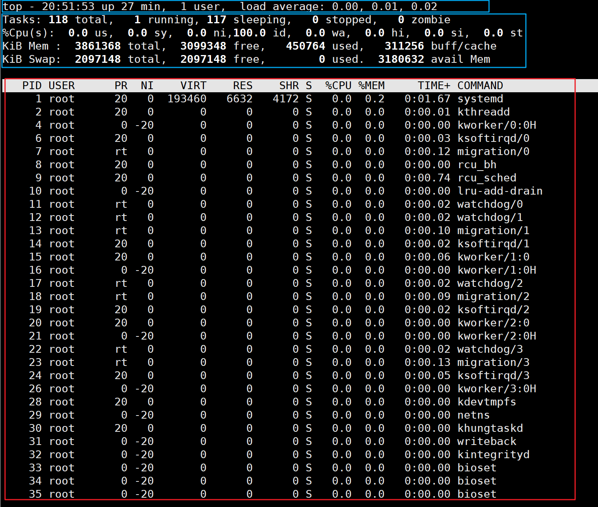

## top 命令

>   top 命令可以动态地，持续地监听进程地运行状态

### 命令格式

```sh
top [选项]
```

### top 选项

| 选项        | 说明                                                         |
| ----------- | ------------------------------------------------------------ |
| -d          | duration 指定 top 命令刷新间隔，默认是 3 秒                  |
| -b          | batch 使用批处理模式输出，一般和"-n"选项合用，用于重定向到文件中 |
| -n +数字    | 指定 top 命令执行的次数                                      |
| -p +进程PID | process 查看指定 ID 的进程                                   |
| -s          | 使 top 命令在安全模式中运行，避免在交互模式中出现错误        |
| -u +用户名  | 只监听某个用户的进程                                         |
|             |                                                              |

### top 显示窗口可用交互按键

-   ? 或 h：显示交互模式的帮助
-   P：按照 CPU 的使用率排序，`默认就是此选项`
-   M：按照内存的使用率排序
-   N：按照 PID 排序；
-   T：按照 CPU 的累积运算时间排序，也就是按照 TIME+ 项排序
-   k：按照 PID 给予某个进程一个信号。一般用于中止某个进程，信号 9 是强制中止的信号
-   r：按照 PID 给某个进程重设优先级（Nice）值
-   q：退出 top 命令

### top 输出内容



### 第一部分

#### 第一行

| 内 容                         | 说 明                                                        |
| ----------------------------- | ------------------------------------------------------------ |
| 12:26:46                      | 系统当前时间                                                 |
| up 1 day, 13:32               | 系统的运行时间，本机己经运行 1 天 13 小时 32 分钟            |
| 1 users                       | 当前登录了1个用户                                            |
| load average: 0.00,0.00，0.00 | 系统在前 1 分钟、5 分钟、15 分钟的平均负载。如果 CPU 是单核的，则这个数值超过 1 就是高负载：如果 CPU 是四核的，则这个数值超过 4 就是高负载 （这个平均负载完全是依据个人经验来进行判断的，一般认为不应该超过服务器 CPU 的核数） |

#### 第二行

| 内 容           | 说 明                                          |
| --------------- | ---------------------------------------------- |
| Tasks: 95 total | 系统中的总进程数                               |
| 1 running       | 正在运行的进程数                               |
| 94 sleeping     | 睡眠的进程数                                   |
| 0 stopped       | 正在停止的进程数                               |
| 0 zombie        | 僵尸进程数。如果不是 0，则需要手工检查僵尸进程 |

#### 

### 第二部分

主要是系统进程信息

-   PID：进程的 ID。
-   USER：该进程所属的用户。
-   PR：优先级，数值越小优先级越高。
-   NI：优先级，数值越小、优先级越高。
-   VIRT：该进程使用的虚拟内存的大小，单位为 KB。
-   RES：该进程使用的物理内存的大小，单位为 KB。
-   SHR：共享内存大小，单位为 KB。
-   S：进程状态。
-   %CPU：该进程占用 CPU 的百分比。
-   %MEM：该进程占用内存的百分比。
-   TIME+：该进程共占用的 CPU 时间。
-   COMMAND：进程的命令名。