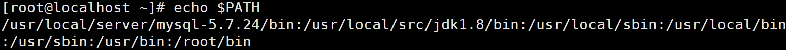
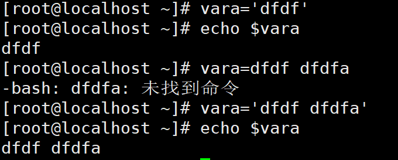
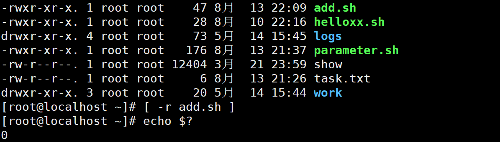

# shell

## 1. shell 概述

>   shell 英文贝壳的意思，在linux中是包裹在操作系统外层的东西。
>
>   shell 是一个命令行解释器，它接收应用程序/用户名， 然后调用操作系统内核。


*   linux 提供的 shll 接收器

    ```sh
    cat /etc/shells
    /bin/sh
    /bin/bash
    /usr/bin/sh
    /usr/bin/bash
    /bin/tcsh
    /bin/csh
    ```

    bash 与 sh 其实就是同一个，sh链接到bash。

    centos 默认的解释器是 bash。

## 2. shell 入门

### 2.1 脚本格式

shell 脚本以`#!/bin/bash`开头，即指定解释器。

```sh
#!/bin/bash
# 开始编写 shell 脚本
```

**脚本案例**

```sh
#!/bin/bash
echo "hello wrold"
```

### 2.2 脚本执行方式

**1）bash 或 sh + 脚本文件的相对路径或绝对路径执行**

该执行方式，不要求该脚本文件具有可执行权限，因为是sh程序去执行的。

案例：

```sh
sh ./helloworld.
sh /tmp/shells/helloworld.sh
```

**2）采用输入脚本的绝对路径或相对路径执行脚本**

<font color="red">要求该脚本必须有可执行权限</font>

案例：

```sh
./helloworld.sh
```

PS：第一种执行方法，本质是 bash 解析器帮你执行脚本，所以脚本本身不需要执行 权限。第二种执行方法，本质是脚本需要自己执行，所以需要执行权限。

**3）在脚本的路径前加上“.  ”或者 source**

案例：

```sh
. ./helloworld.sh
# 或者
source ./hellowrold.sh
```

>   前两种方式都是在当前 shell 中打开一个子 shell 来执行脚本内容，当脚本内容结束，则 子 shell 关闭，回到父 shell 中。
>
>   第三种，也就是使用在脚本路径前加“.”或者 source 的方式，可以使脚本内容在当前 shell 里执行，而无需打开子 shell！这也是为什么我们每次要修改完/etc/profile 文件以后，需要 source 一下的原因。
>
>   开子 shell 与不开子 shell 的区别就在于，环境变量的继承关系，如在子 shell 中设置的 当前变量，父 shell 是不可见的。

## 3. 变量

### 3.1 系统预定义变量

1）常用系统变量

`$HOME、$PWD、$SHELL、$USER、$PATH`等

$HOME：当前用户加目录


$PWD：当前路径


$USER：当前用户


$PATH：环境变量



### 3.2 显示变量

**1）环境变量**：$PATH

```sh
echo $PATH
```

**2）当前 Shell 中所有变量**：set

```sh
set
```


**3）查看变量值**：

```sh
echo $变量名
```

### 3.3 自定义变量

shell 中的变量是没有类型，不像Java有类型、需定义。

**1）定义变量基本语法**

```sh
变量名=变量值 # 注意，=号前后不能有空格
```

<font color="red">=号前后不能有空格，若有空格shell 会将变量名当作命令，当做命令是一般是找不到的</font>

**2）变量的值**

*   不加单引号或者双引号的普通字符串或数字，注意：如果有空格则空格之后的不被当作变量的值，而是当作bash 命令。
*   双引号的字符串，加双引号的字符串当作一个状态输出，但特殊的字符串 $n会替换成变量（传递的变量值）的值。
*   单引号的字符串，加单引号的字符串会被原样输出。

**3）撤销变量基本语法**

```sh
unset 变量名
```

****

案例：



```sh
#!/bin/bash
echo "hello $1"
```


### 3.4 特殊变量

shell 作为一个脚本语言，应该提供交互的能力，即可以传递参数，如：`ls ./`等，那么这个参数如何接收。这个时候就需要特殊的变量。

####  3.4.1 $n

>   $n （功能描述：n 为数字，$0 代表该脚本名称，$1-$9 代表第一到第九个参数，十以 上的参数，十以上的参数需要用大括号包含，如${10}，加大括号以区别 \$1）

```sh
#!/bin/bash
echo '========= $0 ============'
echo $0
echo '========= $1 ============'
echo $1
echo '========= $2 ============'
echo $2
```


#### 3.4.2 $#

>   $# 功能：获取所有输入参数个数，常用于循环, 判断参数的个数是否正确以及加强脚本的健壮性

```sh
#!/bin/bash
echo '========= $0 ============'
echo $0
echo '========= $1 ============'
echo $1
echo '========= $2 ============'
echo $2
echo '========= $# ============'
echo $#
```


#### 3.4.3 \$\* 与 \$@ 

>   \$\* 功能：这个变量代表命令行中所有的参数，\$* 把所有的参数看成一个整体。
>
>   \$@ 功能：这个变量也代表命令行中所有的参数，不过 \$@ 把每个参数区分对待。

```txt
> ./parameter.sh a b c d e f g
==========$n==========
./parameter.sh
a
b
==========$#==========
7
==========$*==========
a b c d e f g
==========$@==========
a b c d e f g
```

**比较\$*和\$@区别**:

*   不被双引号“”包含时，都以$1 $2 …$n 的形式输出所有参数。
*   被双引号“”包含时，\$*会将所有的参数作为一个整体，以“\$1 \$2 …\$n”的形式输 出所有参数；\$@会将各个参数分开，以“\$1” “\$2”…“\$n”的形式输出所有参数。

#### 3.4.4 $?

>   $？ 功能：最后一次执行的命令的返回状态。如果这个变量的值为 0，证明上一 个命令正确执行；如果这个变量的值为非 0（具体是哪个数，由命令自己来决定），则证明 上一个命令执行不正确了。

## 4. 运算符

shell 当作一门变成语言，定义变量总不能只有读取而没有运算操作。如：算术运算。

**引入**

定义一个变量：`a = 1 + 2`。在其他变成语言是完全正确的，但是对于shell而言是错误，空格是命令和参数的分隔符，所以` a = 1 + 2` 一定无法执行。

所以shell 提供了一个执行表达式的命令 `expr`（expression）:

expr 表达式必须有空格，因为expr 接收三个参数（运算符 + 运算数）

```sh
expr 1 + 2
```

**PS**: expr 很少使用，甚至不使用，所以 linux 提供了更加简单的执行方式。

**基本语法**

```sh
$((运算式))
#或 
$[运算式]
```

**PS**: 使用 `\$(()) 或者 $[]` 执行表达式，表达式对空格不敏感，即有无都无影响。

**案例**1


**案例**2

```sh
#!/bin/bash
a=$1
b=$2
sum=$[$a + $b]
echo $sum

```


## 5. 条件判断

对于一个编程语言少不了流程判断，而流程判断就必然右条件判断，即条件表达式的真假。

**基本语法**: test 命令

```sh
# 可以使用test 命令，使用test不分隔，整体当作test的参数
test 条件表达式
# 返回 0 则条件表达式为真
# 控制台使用 $? 去获取返回结果

# ********** 简写，注意表达式前后有空格，并且注意条件表达式的分隔 ***********
[ 条件表达式 ]
```

注意：

*   表达式的分隔，1 = 1（而不是 1=1，因为1=1可能会被当作一个整体）
*   [] 注意表达式前后有空格，并且注意条件表达式的分隔

**案例**


注意空格

**特殊情况**

1.   [ fdfkdf ] 只有值，则为真
2.   [      ] 只有空格，则为假

### 5.1 条件运算符

shell 中没有大于，小于等运算符，其中 > 输出重定向，< 输入重定向，所以shell是不能使用大于小于运算符的。上面的 “=”其实是字符串的等于。

**1）两个数的比较**

*   等于：-eq
*   不等于：-neq
*   小于：-lt
*   小于等于：-le
*   大于：-gt
*   大于等于：-ge

ps：如果是字符串之间的比较，使用等号“=”判断相等，用“!=”判断不等。

**2）文件权限的判断**

*   -r：读
*   -w：写
*   -x：执行

使用 [ -权限 文件 ] 进行判断



 **3）文件类型判断**

*   -e：文件存在
*   -f：文件存在并且是一个文件
*   -d：文件存在并且是一个目录


### 5.2 多条件与或非

>   多条件判断，&& 表示前一条**命令**执行成功时（不是表达式为真），才会执行后一条命令，|| 表示上一条命令执行失败后，才会执行下一条命令

与： && 

或：|| 

## 6. 流程控制

### 6.1 if 判断

#### 6.1.1 基本语法

在其他编程语言中通常以括号 {} 来代表代码块，shell中 if 语句以 then 代表 if 中的代码块开始（即接下来做什么）。

##### 单分支

```sh
if [ 条件判断式 ];then
	# 程序
fi
```

或者

```sh
if [ 条件判断式 ]
then
	# 程序
fi
```

补充：为什么两个if 格式 不换行要有分号“;”呢？

因为，分号用于分隔两个命名，如下图，将 cd 和 ls 写在一切：


**案例**

```sh
#!/bin/bash

if [ $1 -eq 1 ]
then
    echo "input is 1"
elif [ $1 -eq 2 ]
then
  echo "input is 2"
fi
```


##### 多分支

```sh
if [ 条件判断式 ]
then
	程序
elif [ 条件判断式 ]
then
	程序
else
	程序
fi
```

 **ps**：①[ 条件判断式 ]，中括号和条件判断式之间必须有空格。②if 后要有空格

### 6.2 case 语句

**基本语法**

case 变量 in，即变量在（in）下面哪种情况。以 ”;;‘’两个分号代表该break结束

```sh
case $变量名 in
"值 1"）
	如果变量的值等于值 1，则执行程序 1
;;
"值 2"）
	如果变量的值等于值 2，则执行程序 2
;;
	# …省略其他分支…
*）
	# 如果变量的值都不是以上的值，则执行此程序
;;
esac
```

注意事项： 

（1）case 行尾必须为单词“in”，每一个模式匹配必须以右括号“）”结束。 

（2）双分号“;;”表示命令序列结束，相当于 java 中的 break。

 （3）最后的“*）”表示默认模式，相当于 java 中的 default

### 6.3 for

**基本语法**

```sh
for (( 初始值;循环控制条件;变量变化 ))
do
	程序
done

# 和
for 变量 in 值 1 值 2 值 3…
do
	程序
done
```

*   for 后面有一个空格，for本身作为一个单独“命令”
*   (())中左右是否有空格，没有影响

**案例1**

```java
#!/bin/bash

sum=0
for (( i=0; i<=100; i++ ))
do
    sum=$[$sum+$i]
done
echo "sum=$sum"

```

**案例2**

```java
#!/bin/bash

for i in $*
do
    echo $i
done

```


**补充**：

在for （()) 中使用i<=100，由前面章节自动 < 是重定向运算符号，并且数值比较使用 -eq，-lt等，为什么这里能使用呢？原因在于两个括号（(双括号里面可以使用))）

### 6.4 while

**基本语法**

```sh
while [ 条件判断式 ]
do
	程序
done
```

注意条件表达式[ 表达式 ]，括号前后有空格

**案例**

```java
#!/bin/bash
sum=0
i=1
while [ $i -le 100 ]
do
   sum=$[$sum+$i]
   i=$[$i+1]
done
echo $sum
```

sum=$[$sum+$i] 这样的写法太过麻烦，可以这样简写

```sh
let sum=sum+$i
```


## 7. 读取控制台输入

shell 是提供交互的语言，可以读取控制台终端输入的信息。

**基本语法**

```sh
read (选项) (参数)
```

**选项**

① -p：指定读取值时的提示符

② -t：指定读取值时等待的时间（秒）如果不加-t 表示一直等待

**参数**

变量：指定读取值的变量名（保存控制的传递的参数值）

**案例**

```sh
#!/bin/bash
read -t 7 -p "Enter your name in 7 seconds :" NN
echo $NN
```

## 8. 函数

### 8.1 系统函数

#### basename

basename 命令会删掉所有的前 缀包括最后一个（‘/’）字符，然后将字符串显示出来。可以理解为取路径里的文件名。本质就是字符串截取，所以不管路径是否存在都会截取最后一个。

**基本语法**

```java
basename [string/pathname] [suffix]
```

*   suffix 为后缀，如果suffix 被指定，basename会将pathname 或string 中的 suffix去掉。


#### dirname 

从给定的包含绝对路径的文件名中去除文件名 （非目录的部分），然后返回剩下的路径（目录的部分）

dirname 可以理解为取文件路径的绝对路径名称。

**基本语法**

```sh
dirname 绝对路径
```


### 8.2 自定义函数

**基本语法**

```sh
[function] functionname[()] {
	# 代码
	[return xxx;]
}

# 调用函数
函数名 参数1 参数2 参数3 ...
```

*   必须在调用函数地方之前，先声明函数，shell 脚本是逐行运行。不会像其它语言一 样先编译。
*   函数返回值，只能通过$?系统变量获得，可以显示加 return 返回，如果不加，将以最后一条命令运行结果，作为返回值。return 后跟数值 n(0-255)

**案例**

```sh
#!/bin/bash
function sum() {
    s=0
    s=$[$1+$2]
    echo "$s"
}
sum $n1 $n2;
```


## 9. 文本工具

### 9.1 cut

cut 的工作就是“剪”，具体的说就是在文件中负责剪切数据用的。cut 命令从文件的每 一行剪切字节、字符和字段并将这些字节、字符和字段输出。

**基本用法**

```sh
cut [选项参数] filename
# 默认分隔符是制表符
```

**参数说明**

| 参数 | 功能                                                   |
| ---- | ------------------------------------------------------ |
| -f   | 列号，提取第几列                                       |
| -d   | delimit 分隔符，按照指定分隔符分割列，默认是制表符“\t” |
| -c   | char 按字符进行切割后加 n 表示取第几列 比如: -c 1      |

**案例**

cut.txt

```txt
dong shen
guan zhen
wo wo
lai lai
le le
```

**1) 切割第一列**

```sh
cut -d " " -f 1 cut.txt
```

**2) 切割第2，3列**: 没有的就是空

```sh
cut -d " " -f 2,3 cut.txt
```

```sh
cat cut.txt |grep guan | cut -d " " -f 1
```

### 9.2 awk

一个强大的文本分析工具，把文件逐行的读入，以空格为默认分隔符将每行切片，切开的部分再进行分析处理。
